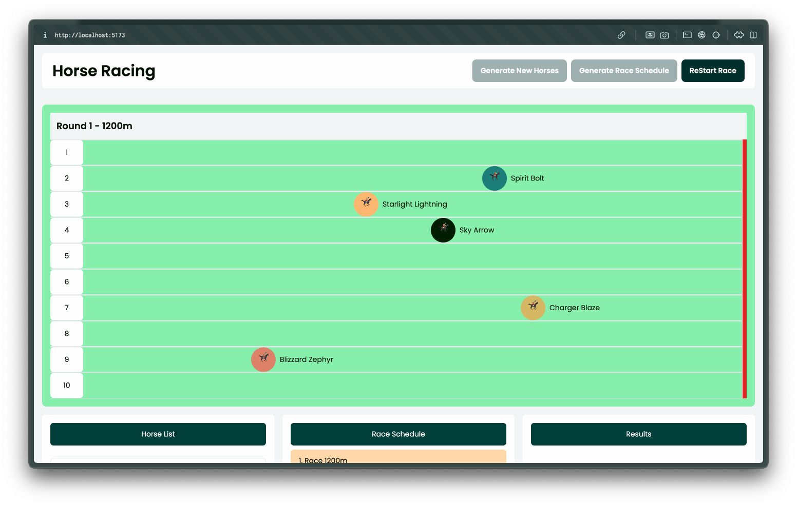

# Horse Racing Application



## Overview
This is a horse racing application built using Vue 3, TypeScript, Pinia, and TailwindCSS. The app allows users to generate a list of 20 unique horses, run a race consisting of 6 laps, and view the results for each lap and the overall race.


## Features
- **Generate Horses**: Randomly generate 20 horses with unique names, colors, and scores (1-100).
- **Random Selection**: Select 10 horses randomly for each lap.
- **Lap System**: The race includes 6 laps with increasing distances:
  - Lap 1: 1200 meters
  - Lap 2: 1400 meters
  - Lap 3: 1600 meters
  - Lap 4: 1800 meters
  - Lap 5: 2000 meters
  - Lap 6: 2200 meters
- **Animated Race**: Animate horses during each lap of the race.
- **Results Display**: View results for each lap and the overall race.

## Technologies Used
- **Frontend**: Vue.js 3 with TypeScript
- **State Management**: Pinia
- **Styling**: TailwindCSS

## Deployment

The application is deployed at [horse-race-app.netlify.app](https://horse-race-app.netlify.app/).

## Setup Instructions

### Prerequisites
- Node.js (LTS version recommended)
- Yarn (package manager)

### Installation
1. Clone the repository:
   ```bash
   git clone <repository_url>
   cd horse-race
   ```

2. Install dependencies:
   ```bash
   yarn install
   ```

3. Start the development server:
   ```bash
   yarn dev
   ```

4. Open your browser and navigate to `http://localhost:5173` to view the app.

### Build for Production
To build the app for production:
```bash
yarn build
```
The compiled files will be located in the `dist` folder.

### Lint and Format Code
To lint and format the codebase:
```bash
yarn lint
```


## Usage Instructions
1. **Generate Horses**:
   - Click the **"Generate Schedule"** button to generate a list of 20 unique horses.

2. **Start the Race**:
   - Click the **"Start Race"** button to begin the race.
   - Horses will be selected randomly for each lap and animated as they progress.

3. **View Results**:
   - After each lap, the results will be displayed in a list.
   - The final results of the race will be shown after all laps are completed.


## License
This project is licensed under the [MIT License](LICENSE).

---

Happy Racing!

